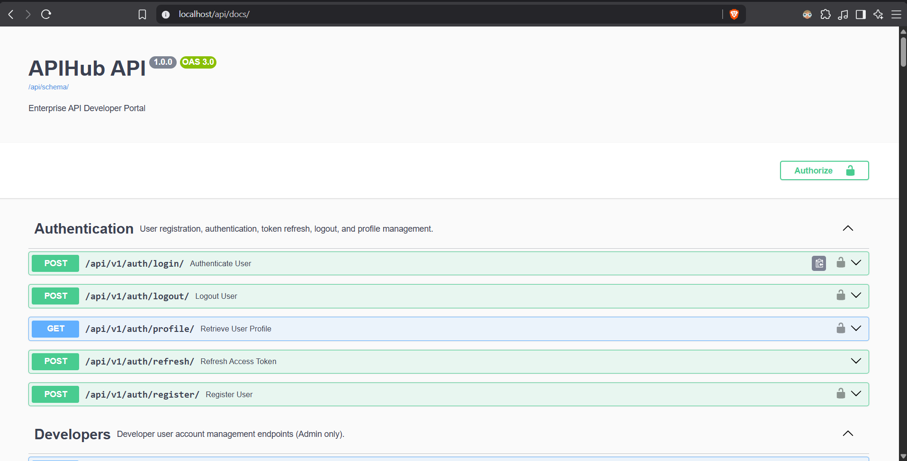
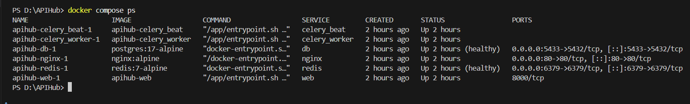
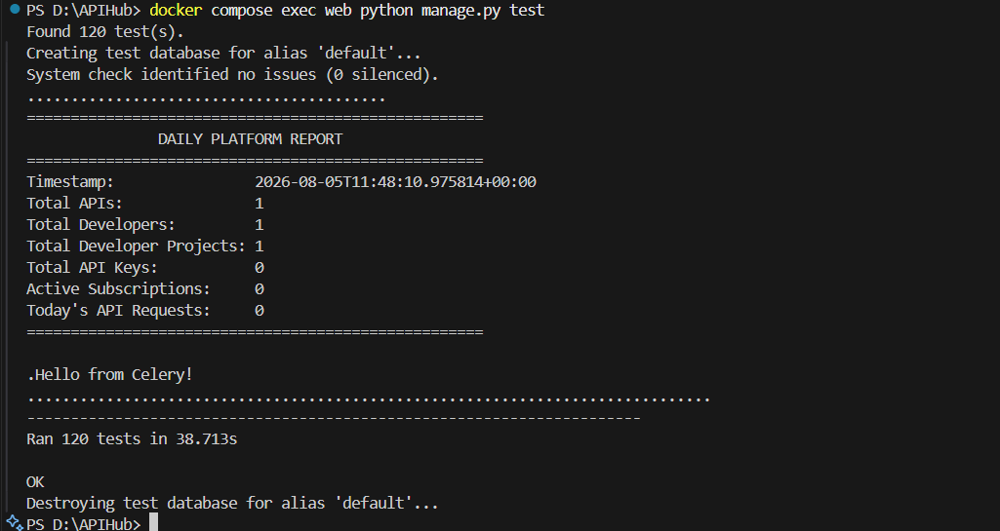
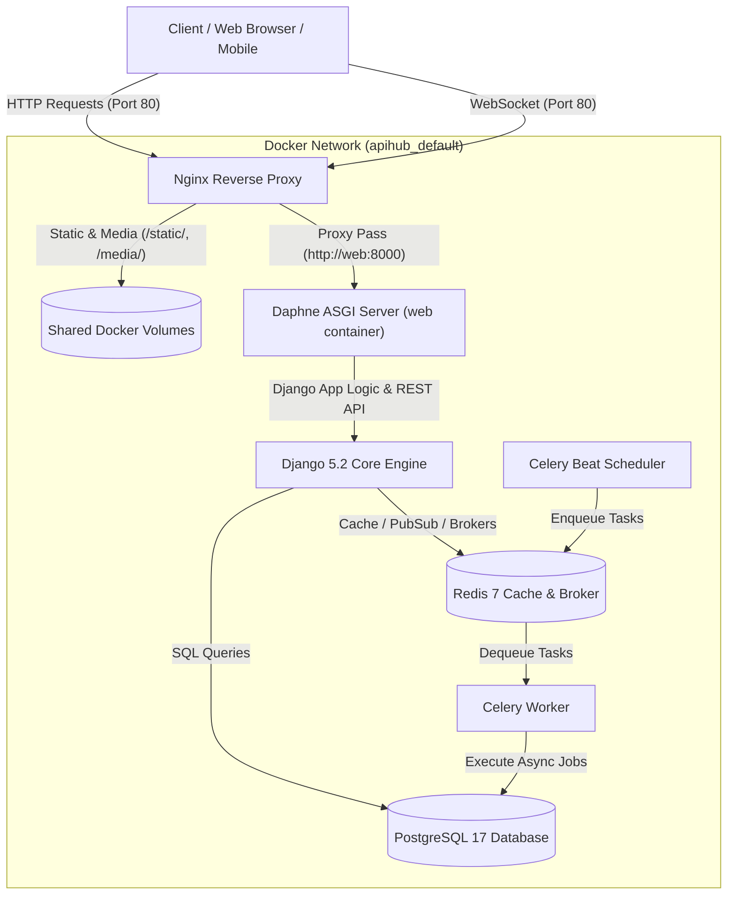
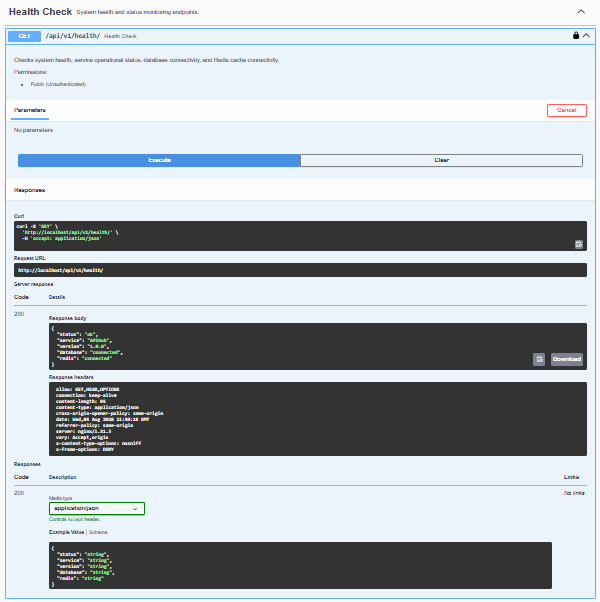
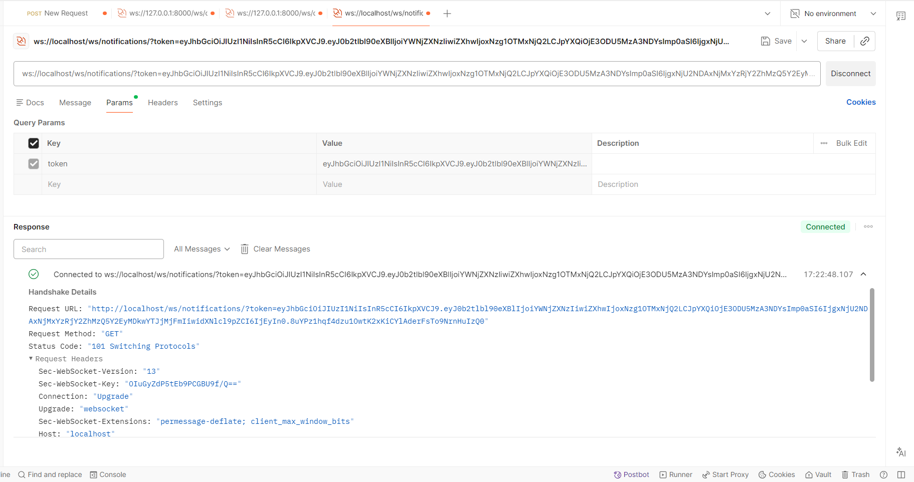
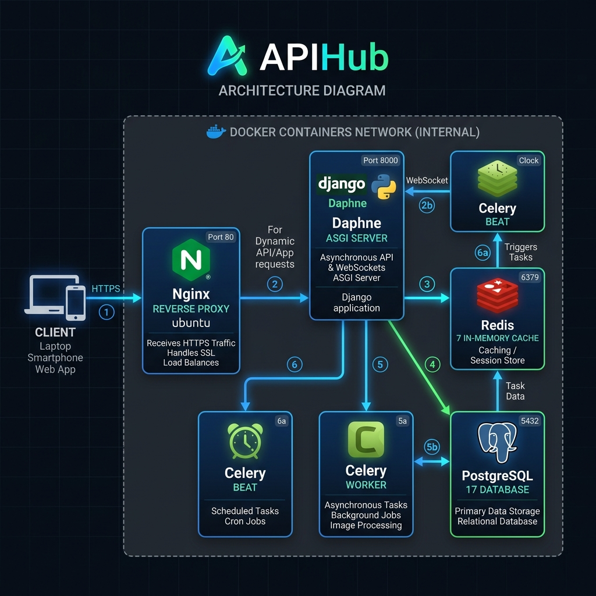

# 🚀 APIHub - Enterprise API Management Platform

[](https://github.com/shrutipatil1088/APIHub/actions)
[](https://www.python.org/)
[](https://www.djangoproject.com/)
[](https://www.django-rest-framework.org/)
[](https://www.docker.com/)
[](https://nginx.org/)
[](https://www.postgresql.org/)
[](https://redis.io/)
[](https://docs.celeryq.dev/)
[](LICENSE)

**APIHub** is a production-grade, enterprise-ready centralized **API Management Platform & Developer Portal** built with Django 5.2, Django REST Framework, Django Channels, PostgreSQL, Redis, Celery, and Nginx.

APIHub acts as an end-to-end gateway and developer ecosystem where administrators manage API catalogs and subscriptions, while developers discover APIs, purchase plans, generate secure API keys, monitor usage analytics, and receive real-time event notifications over WebSockets.

---

## ⭐ Project Highlights

- ✔ **JWT Pair Authentication** (Access & Refresh token rotation with blacklisting)
- ✔ **Role-Based Access Control (RBAC)** (Strict Admin vs Developer permissions)
- ✔ **API Key Middleware Verification** (Cryptographic generation with SHA-256 database storage)
- ✔ **Multi-Tier Subscription Quotas** (Monthly request limits & automated status handling)
- ✔ **Production Dockerized Setup** (Multi-container orchestration via Docker Compose)
- ✔ **Nginx Reverse Proxy** (High-performance static/media asset delivery & HTTP/WS proxying)
- ✔ **PostgreSQL 17 Database** (Relational integrity, soft-deletes, & UUID primary keys)
- ✔ **Redis 7 In-Memory Store** (Distributed cache, channel layer & Celery broker)
- ✔ **Celery & Celery Beat** (Asynchronous tasks & periodic scheduled jobs)
- ✔ **Real-Time WebSockets** (Django Channels pub/sub notification delivery)
- ✔ **Automated OpenAPI 3.0 Documentation** (Interactive Swagger UI integration)
- ✔ **120 Automated Tests** (100% passing unit & integration test suite)
- ✔ **Production-Ready Architecture** (Zero-downtime Nginx buffering, CORS, & health checks)

---

## 📸 Project Preview

### Interactive Swagger API Documentation


---

### Docker Container Stack Running (`docker compose ps`)


---

### Automated Test Suite (120 Tests Passing)


---

## 📌 Table of Contents

- [Project Overview](#-project-overview)
- [Project Highlights](#-project-highlights)
- [Project Preview](#-project-preview)
- [API Endpoints Overview](#-api-endpoints-overview)
- [System Architecture](#-system-architecture)
- [Technology Stack](#-technology-stack)
- [Project Structure](#-project-structure)
- [Database ERD & Relationships](#-database-erd--relationships)
- [Docker Container Architecture](#-docker-container-architecture)
- [Getting Started](#-getting-started)
  - [Environment Variables Setup](#environment-variables-setup)
  - [Running with Docker Compose](#running-with-docker-compose-recommended)
  - [Manual Local Development Setup](#manual-local-development-setup)
- [API Documentation & Health Check](#-api-documentation--health-check)
- [Real-Time WebSockets & Notifications](#-real-time-websockets--notifications)
- [Celery Background Job Execution](#-celery-background-job-execution)
- [Automated Test Suite](#-automated-test-suite)
- [Screenshots](#-screenshots)
- [Contributing](#-contributing)
- [Author & License](#-author--license)

---

## 💡 Project Overview

In modern microservice and API-driven architectures, managing access, authentication, subscriptions, usage limits, and real-time observability is critical. **APIHub** delivers a full-stack backend platform providing:

- **API Governance**: Administrators publish, version, and document APIs and individual endpoints.
- **Developer Ecosystem**: Developers register accounts, create projects, and manage secure API keys.
- **Subscription Engine**: Flexible multi-tiered subscription plans (Free, Monthly, Yearly) with request limit enforcement.
- **API Key Authentication Middleware**: High-performance SHA-256 hashed API Key verification middleware that handles usage tracking, expiration checks, and status validation.
- **Usage Logging & Analytics**: Automatic capture of response times, HTTP status codes, client IP addresses, and user agents per API request.
- **Real-Time Dashboards & Notifications**: Live WebSocket connections delivering real-time metric updates and event notifications to connected frontend clients.
- **Asynchronous Task Processing**: Automated scheduled reports, log archiving, and subscription expiry reminders via Celery Beat & Redis.

---

## 🔗 API Endpoints Overview

A high-level summary of the primary REST API endpoints available on APIHub:

| Category | HTTP Method | Endpoint Path | Description | Access Level |
| :--- | :--- | :--- | :--- | :--- |
| **Health Check** | `GET` | `/api/v1/health/` | System status, DB & Redis health check | Public |
| **Authentication** | `POST` | `/api/v1/auth/register/` | Register new developer account | Public |
| **Authentication** | `POST` | `/api/v1/auth/login/` | Authenticate user & receive JWT pair | Public |
| **Authentication** | `POST` | `/api/v1/auth/refresh/` | Refresh expired JWT access token | Public |
| **Authentication** | `POST` | `/api/v1/auth/logout/` | Blacklist refresh token & logout | Authenticated |
| **Authentication** | `GET` | `/api/v1/auth/profile/` | Fetch authenticated user profile | Authenticated |
| **Developers** | `GET` | `/api/v1/auth/developers/` | List all developer accounts | Admin Only |
| **API Catalog** | `GET` / `POST` | `/api/v1/catalog/apis/` | List or create APIs | Public / Admin |
| **API Catalog** | `GET`/`PATCH`/`DELETE` | `/api/v1/catalog/apis/{uuid}/` | Retrieve, update, or soft-delete API | Public / Admin |
| **API Catalog** | `GET` | `/api/v1/catalog/apis/{uuid}/documentation/` | Full structural documentation | Authenticated |
| **Subscriptions** | `GET` / `POST` | `/api/v1/subscriptions/plans/` | List active plans or create new plan | Public / Admin |
| **Subscriptions** | `POST` | `/api/v1/subscriptions/user-subscriptions/` | Purchase subscription plan | Developer Only |
| **Subscriptions** | `GET` | `/api/v1/subscriptions/me/` | List my active subscriptions | Developer Only |
| **Projects** | `GET` / `POST` | `/api/v1/developer-projects/` | List or create developer projects | Developer Only |
| **API Keys** | `GET` / `POST` | `/api/v1/api-keys/` | List or generate new API key (`pk_live_...`) | Developer Only |
| **API Keys** | `POST` | `/api/v1/api-keys/{uuid}/regenerate/` | Regenerate API key pair | Owner Only |
| **API Keys** | `GET` | `/api/v1/api-keys/protected-sample/` | Sample endpoint protected by API Key | API Key Required |
| **Usage Logs** | `GET` | `/api/v1/usage-logs/` | Query & filter API request logs | Owner / Admin |
| **Dashboard** | `GET` | `/api/v1/dashboard/admin/` | Platform-wide administrative metrics | Admin Only |
| **Dashboard** | `GET` | `/api/v1/dashboard/developer/` | Personal analytics & quota metrics | Developer Only |
| **Notifications** | `GET` | `/api/v1/notifications/` | List notifications | Authenticated |
| **Notifications** | `PATCH` | `/api/v1/notifications/{uuid}/read/` | Mark notification as read | Owner Only |

---

## 🏗️ System Architecture



---

## 🛠️ Technology Stack

| Category | Technology | Version | Purpose |
| :--- | :--- | :--- | :--- |
| **Language** | Python | `3.12` | Core programming language |
| **Framework** | Django | `5.2` | Primary Web Framework |
| **API Engine** | Django REST Framework | `3.15` | REST API construction & serialization |
| **Database** | PostgreSQL | `17` | Relational database for persistent storage |
| **Caching & Broker**| Redis | `7.4` | In-memory cache, WebSocket channel layer & Celery broker |
| **Task Queue** | Celery | `5.4` | Asynchronous task execution engine |
| **Scheduler** | Celery Beat | `5.4` | Periodic cron-like task scheduler |
| **ASGI Server** | Daphne | `4.1` | ASGI server for HTTP/2 & WebSockets |
| **WebSockets** | Django Channels | `4.2` | Event-driven WebSocket framework |
| **Reverse Proxy** | Nginx | `Alpine` | High-performance reverse proxy & static asset server |
| **Containerization**| Docker & Docker Compose | `latest` | Multi-container orchestration |
| **Auth & Security** | DRF SimpleJWT | `5.5` | JSON Web Token authentication |
| **Documentation** | drf-spectacular | `0.28` | OpenAPI 3.0 schema generation & Swagger UI |

---

## 📂 Project Structure

```text
APIHub/
├── apps/                        # Modular Django Applications
│   ├── accounts/                # Authentication, User Models, JWT & Roles
│   ├── api_catalog/             # API Metadata, Versions, & Endpoints
│   ├── subscriptions/           # Subscription Plans & User Quotas
│   ├── developer_projects/      # Developer Workspaces & Project Scoping
│   ├── api_keys/                # Key Generation, SHA-256 Hashing & Verification
│   ├── usage_logs/              # API Request Audit Logging & Filtering
│   ├── dashboard/               # Analytics Aggregation & Live WebSocket Dashboards
│   ├── notifications/           # Model Notifications & WebSocket Broadcasting
│   └── core/                    # Health Checks, Base Mixins, & Celery Tasks
├── config/                      # Django Project Configuration Root
│   ├── settings/                # Environment-Specific Settings (base, dev, prod)
│   ├── asgi.py                  # ASGI Protocol Routing (HTTP + WebSockets)
│   ├── celery.py                # Celery App Configuration
│   └── urls.py                  # Global URL Router
├── nginx/                       # Nginx Reverse Proxy Configuration
│   └── default.conf             # Nginx Server Block & Proxy Rules
├── .env.docker                  # Environment Variables for Docker Stack
├── Dockerfile                   # Python 3.12 Application Docker Container Build
├── docker-compose.yml           # Multi-Container Orchestration Manifest
├── entrypoint.sh                # Container Initialization Script
├── manage.py                    # Django Administrative CLI Tool
├── requirements.txt             # Python Package Dependencies
├── LICENSE                      # MIT Open Source License
└── README.md                    # Project Documentation
```

---

## 🐳 Docker Container Architecture

The deployment consists of 6 specialized containers orchestrated via Docker Compose:

| Container Service | Base Image | Internal Port | Exposed Host Port | Function / Purpose |
| :--- | :--- | :--- | :--- | :--- |
| **`nginx`** | `nginx:alpine` | `80` | **`80:80`** | Primary public entrypoint; serves `/static/` and `/media/` directly and proxies API/WebSocket traffic to Daphne. |
| **`web`** | `python:3.12-slim`| `8000` | *Internal Only* | Runs Daphne ASGI Server executing Django REST Framework, WebSockets, and business logic. |
| **`db`** | `postgres:17-alpine`| `5432` | **`5432:5432`** | Primary relational database storing accounts, APIs, keys, logs, and subscriptions. |
| **`redis`** | `redis:7-alpine` | `6379` | **`6379:6379`** | In-memory data store used as Celery message broker, Django cache, and Channels layer. |
| **`celery_worker`**| `python:3.12-slim`| - | - | Executes asynchronous background tasks (log cleanup, report generation, notifications). |
| **`celery_beat`** | `python:3.12-slim`| - | - | Periodic cron scheduler enqueuing automated jobs into Redis at specified intervals. |

---

## 🚀 Getting Started

### Environment Variables Setup

Create a `.env.docker` file in the root directory (or use `.env` for local execution). **Never commit production secret keys to version control**:

```env
SECRET_KEY=replace-with-your-secret-key
DEBUG=True

# PostgreSQL Settings
POSTGRES_DB=apihub_db
POSTGRES_USER=apihub_user
POSTGRES_PASSWORD=apihub_password
POSTGRES_HOST=db
POSTGRES_PORT=5432

DB_NAME=apihub_db
DB_USER=apihub_user
DB_PASSWORD=apihub_password
DB_HOST=db
DB_PORT=5432

# Redis & Celery Settings
REDIS_HOST=redis
REDIS_PORT=6379
REDIS_DB=0
REDIS_URL=redis://redis:6379/0
CELERY_BROKER_URL=redis://redis:6379/0
CELERY_RESULT_BACKEND=redis://redis:6379/0
```

---

### Running with Docker Compose (Recommended)

1. **Clone the repository**:
   ```bash
   git clone https://github.com/shrutipatil1088/APIHub.git
   cd APIHub
   ```

2. **Build and start all services**:
   ```bash
   docker compose up -d --build
   ```

3. **Verify container status**:
   ```bash
   docker compose ps
   ```

4. **Stream application logs**:
   ```bash
   docker compose logs -f nginx web
   ```

---

## 📖 API Documentation & Health Check

### Health Check Endpoint
APIHub includes a dedicated system health monitoring endpoint:
```bash
curl -i http://localhost/api/v1/health/
```
**Sample Response**:
```json
{
  "status": "healthy",
  "service": "APIHub",
  "version": "1.0.0",
  "database": "connected",
  "redis": "connected"
}
```

### Interactive Swagger UI
Access the automatically generated OpenAPI 3.0 documentation:
- **Swagger Documentation**: [http://localhost/api/docs/](http://localhost/api/docs/)
- **OpenAPI Schema (JSON)**: [http://localhost/api/schema/](http://localhost/api/schema/)

---

## ⚡ Real-Time WebSockets & Notifications

APIHub leverages **Django Channels** and **Redis Pub/Sub** to stream live events to connected clients over Nginx.

### Available WebSocket Endpoints

| WS Endpoint | Auth Required | Description |
| :--- | :--- | :--- |
| `ws://localhost/ws/notifications/` | **Yes (JWT)** | Delivers personal notifications (e.g. key creation, plan expiry notices). |
| `ws://localhost/ws/dashboard/` | **Yes (JWT)** | Streams real-time analytics updates to Admin or Developer dashboards. |

---

## ⏱️ Celery Background Job Execution

APIHub uses Celery Beat for periodic task orchestration:

1. **Daily Platform Report** (`apps.core.tasks.generate_daily_report`): Runs every midnight at `00:00 UTC` to aggregate system statistics.
2. **Subscription Expiry Reminders** (`apps.core.tasks.check_subscription_reminders`): Runs daily at `08:00 UTC` to notify developers of subscriptions expiring within 3 days.
3. **Usage Log Cleanup** (`apps.core.tasks.delete_old_usage_logs`): Runs every Sunday at `02:00 UTC` to delete audit logs older than 90 days.

---

## 🧪 Automated Test Suite

APIHub features a comprehensive test suite containing **120 automated tests** covering authentication, permissions, CRUD endpoints, database transactions, WebSocket communicators, and Celery tasks.

### Run All Tests inside Docker:
```bash
docker compose exec web python manage.py test
```

### Sample Output:
```text
Found 120 test(s).
Creating test database for alias 'default'...
System check identified no issues (0 silenced).
........................................................................................................................
----------------------------------------------------------------------
Ran 120 tests in 67.788s

OK
Destroying test database for alias 'default'...
```

---

## 📸 Screenshots

### 1. Swagger UI (`http://localhost/api/docs/`)


---

### 2. Docker Containers Running (`docker compose ps`)


---

### 3. Automated Test Suite (120 Tests Passing)


---

### 4. System Health Check Endpoint (`/api/v1/health/`)


---

### 5. WebSocket Real-Time Notifications


---

### 6. Platform System Architecture Diagram


---

## 🤝 Contributing

Contributions are welcome! To contribute:

1. Fork the repository (`https://github.com/shrutipatil1088/APIHub/fork`).
2. Create a feature branch (`git checkout -b feature/amazing-feature`).
3. Commit your changes (`git commit -m "feat: add amazing feature"`).
4. Push to the branch (`git push origin feature/amazing-feature`).
5. Open a Pull Request for review.

---

## 👨‍💻 Author & License

**Shruti Patil**
- **GitHub**: [@shrutipatil1088](https://github.com/shrutipatil1088)
- **Project Repository**: [APIHub Repository](https://github.com/shrutipatil1088/APIHub)

This project is licensed under the **MIT License** - see the [LICENSE](LICENSE) file for details.